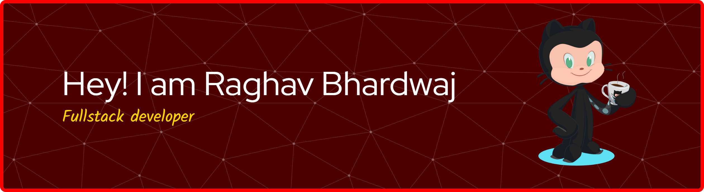

<!-- Replace the src URL below with your own custom banner image link -->

  

 

<h1 align="center">Hi, I’m Raghav Bhardwaj</h1>

<h4 align="center">Full-Stack Developer | Building RAG Systems | Agentic Architectures</h4>

## 🛠️ Skills

* List of Technologies Which I've Learned so far :)

| Category | Skills |
| :--- | :--- |
| **Programming Languages** |      |
| **Frameworks & Web** |       |
| **AI / ML & GenAI** |      |
| **Databases** |    |
| **Tools** |  |

## 🌐 Let's Connect:

  
  
   
   

